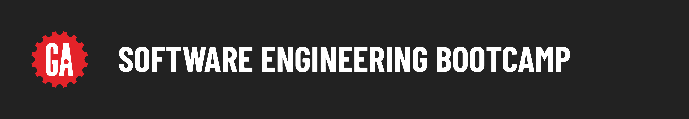

# Welcome to General Assembly SEB!

This will be your classroom wiki! Links to guides, in-class labs & code solutions, and other resources will live here.

### Contents

- [Course Dates and Holidays](#course-dates-and-holidays)
- [Instructional Team / Contact Info](#instructional-team-contact-information)
- [Course Curriculum](#course-curriculum)
- [Becoming Familiar With the SEB GitHub Workflow](#github-homework-submission)
- [Daily JavaScript Code Challenges](#daily-coding-challenges)
- [Additional Coding Practice Resources](#additional-coding-practice-resources)
- [Computer Science](#computer-science)
- [Immersive Graduation Requirements](#ga-seb-graduation-requirements)

***
### Course Dates and Holidays

- Course duration: June 29th - September 18th
- Holidays:
  - July 6th & 7th
  - September 4th

***
### Instructional Team Contact Information

<table>
  <tr>
    <th> Role </th><th> Name </th> <th>Slack </th> <th>Email </th>
  </tr>
  <tr>
    <td> Lead Instructor </td> <td> Arthur Bernier </td><td> @Arthur Bernier Jr </td><td> arthur.bernier@generalassemb.ly </td>
  </tr>
  <tr>
    <td> Lead Instructor </td> <td> Kristina VanBergen-DeSilva </td><td> @Kristina </td><td> kristina.vanbergen-desilva@generalassemb.ly </td>
  </tr>
  <tr>
    <td> Instructional Associate </td> <td> Jameela Asad </td><td> @Jameela Asad </td><td> jameela.khalil.95@gmail.com </td>
  </tr>
  <tr>
    <td> Instructional Associate </td> <td> Abdullah Hisham </td><td> @Abdullah Hisham </td><td> aboood23.ae@gmail.com </td>
  </tr>
  <tr>
    <td> Instructional Associate </td> <td> Shahnaz Alqassab </td><td> @Shahnaz Alqassab </td><td> s.alqassab@gmail.com </td>
  </tr>
</table>

***
### Course Curriculum

The following is an overall schedule and is subject to change.

<details><summary><strong>Unit 1</strong> - Front-End Fundamentals </summary>
<br>
<p>Unit 1 will cover the fundamentals of web development, including Git and GitHub, the command line interface (CLI), HTML, CSS, JavaScript, and DOM events.</p>

<ul type="none">
  <li><details>
    <summary><strong>Week 1</strong></summary>
    <table>
        <thead>
            <tr>
            <th>Sunday</th>
            <th>Monday</th>
            <th>Tuesday</th>
            <th>Wednesday</th>
            <th>Thursday</th>
            <th>Level-Up</th>
            </tr>
        </thead>
        <tbody>
            <tr>
            <td><a href="https://github.com/SEB-9-BH/u1-installfest">Installfest</a></td>
            <td><a href="https://github.com/SEB-9-BH/u1-intro-to-html">Intro to HTML </a></td>
            <td><a href="https://github.com/SEB-9-BH/u1-intro-to-js-functions">Intro to JavaScript Functions </a></td>
            <td><a href="https://github.com/SEB-9-BH/u1-intro-to-js-arrays">Intro to JavaScript Arrays </a></td>
            <td><a href="https://github.com/SEB-9-BH/u1-intro-to-the-dom">Intro to the DOM</a></td>
            <td><a href="https://github.com/SEB-9-BH/u1-js-browser-game-tamagotchi-lab">JavaScript Browser Game - Tamagotchi Lab Solution</a></td>
            </tr>
            <tr>
            <td><a href="https://github.com/SEB-9-BH/u1-intro-to-cli">Intro to the CLI</a></td>
            <td><a href="https://github.com/SEB-9-BH/u1-intro-to-css">Intro to CSS </a></td>
            <td><a href="https://github.com/SEB-9-BH/u1-intro-to-js-functions-lab">Intro to JavaScript Functions Lab </a></td>
            <td><a href="https://github.com/SEB-9-BH/u1-intro-to-js-arrays-lab">Intro to JavaScript Arrays Lab </a></td>
            <td><a href="https://github.com/SEB-9-BH/u1-dom-events">DOM Events</a></td>
            <td></td>
            </tr>
            <tr>
            <td><a href="https://github.com/SEB-9-BH/u1-intro-to-cli-lab">Intro to the CLI Lab</a></td>
            <td><a href="https://github.com/SEB-9-BH/u1-intro-to-js">Intro to JavaScript </a></td>
            <td><a href="https://github.com/SEB-9-BH/u1-js-scope">JavaScript Scope </a></td>
            <td><a href="https://github.com/SEB-9-BH/u1-intro-to-js-objects">Intro to JavaScript Objects </a></td>
            <td><a href="https://github.com/SEB-9-BH/u1-dom-events-lab">DOM Events Lab</a></td>
            <td></td>
            </tr>
            <tr>
            <td><a href="https://github.com/SEB-9-BH/u1-intro-to-git-and-github">Intro to Git and GitHub</a></td>
            <td><a href="https://github.com/SEB-9-BH/u1-js-control-flow">Javascript Control Flow </a></td>
            <td><a href="https://github.com/SEB-9-BH/u1-mdn">MDN</a></td>
            <td><a href="https://github.com/SEB-9-BH/u1-intro-to-js-objects-lab">Intro to JavaScript Objects Lab </a></td>
            <td><a href="https://github.com/SEB-9-BH/u1-js-browser-game-rock-paper-scissors">JavaScript Browser Game - Rock, Paper, Scissors</a></td>
            <td></td>
            </tr>
            <tr>
            <td></td>
            <td></td>
            <td></td>
            <td></a></td>
            <td><a href="https://github.com/SEB-9-BH/u1-js-browser-game-tic-tac-toe-lab">JavaScript Browser Game - Tic-Tac-Toe Lab</a></td>
            <td></td>
            </tr>
        </tbody>
        </table>
  </details></li>

  ___
  <li><details>
    <summary><strong>Week 2</strong></summary>
      <table>
        <thead>
            <tr>
            <th>Sunday</th>
            <th>Monday</th>
            <th>Tuesday</th>
            <th>Wednesday</th>
            <th>Thursday</th>
            <th>Level-Up</th>
            </tr>
        </thead>
        <tbody>
            <tr>
            <td><strong>HOLIDAY</strong></td>
            <td><strong>HOLIDAY</strong></td>
            <td><a href="https://github.com/SEB-9-BH/u1-intermediate-css">Intermediate CSS </a></td>
            <td><a href="https://github.com/SEB-9-BH/u1-js-array-iteratator-methods">Javascript Array Iterator Methods </a></td>
            <td><a href="https://github.com/SEB-9-BH/u1-project-requirements">Unit 1 Project - Browser-Based Game</a></td>
            <td><a href="https://github.com/SEB-9-BH/u1-playing-audio-in-the-browser">Playing Audio in the Browser Lesson + Starter Code </a></td>
            </tr>
            <tr>
            <td></td>
            <td></td>
            <td><a href="https://github.com/SEB-9-BH/u1-flexbox">Flexbox</a></td>
            <td><a href="https://github.com/SEB-9-BH/u1-js-array-iteratator-methods-lab">Javascript Array Iterator Methods Lab </a></td>
            <td><strong>Outcomes</strong></td>
            <td><a href="https://github.com/SEB-9-BH/card-game-starter-lesson">Card Game Lesson + Starter Code</a></td>
            </tr>
            <tr>
            <td></td>
            <td></td>
            <td><a href="https://github.com/SEB-9-BH/u1-flexbox-lab">Flexbox Lab </a></td>
            <td><a href="https://github.com/SEB-9-BH/u1-intro-to-markdown-lab">Intro to Markdown Lab </a></td>
            <td></td>
            <td><a href="https://github.com/SEB-9-BH/u1-css-grid">CSS Grid </a></td>
            </tr>
            <tr>
            <td></td>
            <td></td>
            <td><a href="https://github.com/SEB-9-BH/u1-responsive-design">Responsive Design </a></td>
            <td><a href="https://github.com/SEB-9-BH/intro-to-ai-coding-tools/">Leveraging Generative AI Tools for Software Engineers - Pt. 1</a></td>          
            <td></td>
            <td><a href="https://github.com/SEB-9-BH/u1-intro-to-js-classes">Intro to JavaScript Classes </a></td>
            </tr>
            <tr>
            <td></td>
            <td></td>
            <td><a href="https://github.com/SEB-9-BH/u1-intro-to-accessibility">Intro to Accessibility </a></td>
            <td><a href="https://github.com/SEB-9-BH/u1-project-planning-deliverables">Unit 1 Project - Project Planning Deliverables</a></td>
            <td></td>
            <td><a href="https://github.com/SEB-9-BH/u1-js-built-in-objects-and-classes">JavaScript's Built-in Objects and Classes </a></td>
            </tr>
            <tr>
            <td></td>
            <td></td>
            <td></td>
            <td></td>
            <td></td>
            <td>Leveraging Generative AI Tools for Software Engineers - Pt. 2<a href=""></a></td> 
            </tr>
        </tbody>
      </table>

  </details></li>

  ___
  <li><details><summary><strong>Week 3</strong></summary>
    Unit 1 Project
  </details></li>
</details>

___
<details><summary><strong>Unit 2</strong> - Full-Stack Fundamentls </summary>
<br>
<p>Unit 2 will introduce backend development using Express and Node, covering RESTful routing, MongoDB, full CRUD operations, data relationships, ERDs, and user authentication.</p>
<ul type="none">

  <li><details><summary><strong>Week 4</strong></summary>

  ### DAY 1

| Activity  | Link |
| ----- | ------ |
| INTRO LESSON Full Stack, HTTP, MVC, Etc | https://github.com/SEB-9-BH/HTTP |
| INTRO TO EXPRESS | https://github.com/SEB-9-BH/intro-to-express |
| HW Express Lab | https://github.com/SEB-9-BH/intro-to-express-lab |

| Supplemental Activity | Link |
| ----------- | -------|
| Intro to Full Stack Videos | https://github.com/SEB-9-BH/intro-to-full-stack-development |
| Intro to HTTP Videos | https://github.com/SEB-9-BH/http-videos |
| Intro to NODE Videos | https://github.com/SEB-9-BH/intro-to-node |
| Postman Setup | https://github.com/SEB-9-BH/postman-setup-lab |

  ### DAY 2 & 3

| Activity  | Link |
| ----- | ------ |
| Setup MongoDB | https://github.com/SEB-9-BH/mongodb-setup |
| INTRO TO REST & MVC | https://github.com/SEB-9-BH/intro-to-rest-mvc |
| HW Vegetables Lab | https://github.com/SEB-9-BH/vegetables-lab-hw |

| Supplemental Activity | Link |
| ----------- | -------|
| EJS Templating Alternative | https://github.com/SEB-9-BH/ejs-level-up |

  ### DAY 4

| Activity  | Link |
| ----- | ------ |
| Controllers | https://github.com/SEB-9-BH/controllers-routers-view-data |
| The Captain's Log HW| https://github.com/SEB-9-BH/captains-log |
    
  </details></li>

  ___
  <li><details><summary><strong>Week 5</strong></summary>
    
### DAY 1

| Activity  | Link |
| ----- | ------ |
| API, Auth & Testing Start | https://github.com/SEB-9-BH/api-exposure |
| Engineer Registry HW | https://github.com/SEB-9-BH/engineer-registry |

### DAY 2

| Activity  | Link |
| ----- | ------ |
| FULL MVC | https://github.com/SEB-9-BH/fruits-mvc-solution |
| Engineer Registry HW | https://github.com/SEB-9-BH/engineer-registry |

### DAY 3

| Activity  | Link |
| ----- | ------ |
| Implementation Guide of MVC | https://github.com/SEB-9-BH/fruits-mvc-solution/blob/main/IMPLEMENTATION_SUMMARY.md |
| Route Architecture |  https://github.com/SEB-9-BH/fruits-mvc-solution/blob/main/ROUTE_ARCHITECTURE.md |
| Testing Breakdown |  https://github.com/SEB-9-BH/fruits-mvc-solution/blob/main/TEST_BREAKDOWN.md |
| Controller Guide |  https://github.com/SEB-9-BH/fruits-mvc-solution/blob/main/CONTROLLER_GUIDE.md |

### DAY 4

| Activity  | Link |
| ----- | ------ |
| Project Preparation & Requirements | https://github.com/SEB-9-BH/fruits-mvc-solution |
| Project Example Starter Guide | https://github.com/SEB-9-BH/fruits-mvc-solution/blob/main/BLOG_APP_STARTER.md |
    
  </details></li>

  ___
  <li><details><summary><strong>Week 6</strong></summary>
    Unit 2 Project
  </details></li>

</details>


___
<details><summary><strong>Unit 3</strong> - React Fundamentals </summary>
<br>
<p>Unit 3 will focus on frontend development with React, exploring components, state management, forms, hooks, client-side routing, building APIs, and user authentication.</p>

<ul type="none">

  <li><details><summary><strong>Week 7</strong></summary>
  
### DAY 1

| Activity  | Link |
| ----- | ------ |
| Intro to React & SPAs | https://github.com/SEB-9-BH/intro-to-spas-and-react |
| React | https://github.com/SEB-9-BH/first-react-lesson |
| HW Modern Js Lab |  https://github.com/SEB-9-BH/modern-js-lab |

### DAY 2

| Activity  | Link |
| ----- | ------ |
| React Components | https://github.com/SEB-9-BH/react-components|
| React Components Lab | https://github.com/SEB-9-BH/react-components-lab|
| React State Management | https://github.com/SEB-9-BH/react-state-management|
| React State Management Lab | https://github.com/SEB-9-BH/react-state-management-lab|

### DAY 3

| Activity  | Link |
| ----- | ------ |
| React Movie Search | https://github.com/SEB-9-BH/react-movie-search|

### DAY 4

| Activity  | Link |
| ----- | ------ |
| React Router Lesson | https://github.com/SEB-9-BH/react-router-lesson|

### Day 5

| Activity  | Link |
| ----- | ------ |
| Git Collaboration | https://github.com/SEB-9-BH/github-collaboration-activity|


  
  </details></li>

  ___
  <li><details><summary><strong>Week 8</strong></summary>

### Day 1

| Activity  | Link |
| ----- | ------ |
| Hackathon (also hw) | https://github.com/SEB-9-BH/hackathon |
| Github Cheatsheet | https://github.com/github-cheatsheet

### Day 2 - 4

| Activity  | Link |
| ----- | ------ |
| Goat Cafe MERN Stack Lesson | https://github.com/SEB-9-BH/goat-cafe-full-stack-mern-app-lesson |
| React Mern Lab HW | https://github.com/SEB-9-BH/mern-lab |

### Day 5
| Activity | Link |
| --------- | -------- |
| Project 3 Prompt | https://github.com/SEB-9-BH/Unit-3-project |

  </details></li>

  ___
  <li><details><summary><strong>Week 9</strong></summary>
    Unit 3 Project
  </details></li>

</details>

___
<details><summary><strong>Unit 4</strong> -  Python Fundamentals </summary>
<br>
<p>Unit 4 will dive into Python-based web development, including PostgreSQL, Django, and Flask, while reinforcing user authentication and key computer science fundamentals.</p>

<ul type="none">

  <li><details><summary><strong>Week 10</strong></summary>

  |                Sunday               |         Monday        |        Tuesday      |        Wedensday       |       Thursday        |        Level-Up       |
  | ----------------------------------- | --------------------- | ------------------- | ---------------------- | --------------------- | --------------------- |
  | Outcomes | [Functions](https://github.com/SEB-9-BH/u4-python-functions) | Review! | [SQL Joins](https://github.com/SEB-9-BH/u4-sql-joins) | Holiday | [Hacker Rank SQL](https://github.com/SEB-9-BH/u4-hacker-rank-sql) |
  | [Python Postgres Django Installfest](https://github.com/SEB-9-BH/u4-python-postgres-django-installfest) | [Functions Lab](https://github.com/SEB-9-BH/u4-python-functions-lab) | [Intro to SQL](https://github.com/SEB-9-BH/u4-intro-to-sql) | [SQL Joins Lab](https://github.com/SEB-9-BH/u4-sql-joins-lab) | | [SQL Library Lab](https://github.com/SEB-9-BH/u4-sql-library-lab) |
  | [Intro to Python](https://github.com/SEB-9-BH/u4-intro-to-python) | Outcomes (Post-Grad)  | [Intro to SQL Lab](https://github.com/SEB-9-BH/u4-intro-to-sql-lab) | [ERD Diagramming](https://github.com/SEB-9-BH/u4-erd-diagramming) | | [SQL Ladder Challenge](https://github.com/SEB-9-BH/u4-sql-ladder-challenges)  |
  | [Control Flow](https://github.com/SEB-9-BH/u4-python-control-flow) | [Data Structures](https://github.com/SEB-9-BH/u4-python-data-structures) | SEB Alumni Panel | [Database Modeling Lab](https://github.com/SEB-9-BH/u4-db-modeling-lab) | | |
  | [Control Flow Lab](https://github.com/SEB-9-BH/u4-python-control-flow-lab) | [Data Structures Lab](https://github.com/SEB-9-BH/u4-python-data-structures-lab) | | | | |
  | | [Classes](https://github.com/SEB-9-BH/u4-python-classes) | | | |
  | | [Classes Lab](https://github.com/SEB-9-BH/u4-python-classes-lab) | | | |
  </details></li>

  ___
  <li><details><summary><strong>Week 11</strong></summary>

  |            Sunday           |            Monday           |            Tuesday          |           Wedensday         |         Thursday          |       Level-Up       |
  | --------------------------- | --------------------------- | --------------------------- | --------------------------- | ------------------------- | -------------------- |
  | [Intro to Django](https://github.com/SEB-9-BH/u4-intro-to-django) | [Cat Collector MPA 2/2](https://github.com/SEB-9-BH/u4-cat-collector-mpa) | [Intro to FastAPI](https://github.com/SEB-9-BH/u4-intro-to-fastapi) | [FastAPI Authentication](https://github.com/SEB-9-BH/u4-python-fastapi-authentication) | [Unit Four Project](https://github.com/SEB-9-BH/u4-project-requirements) | Intro to Flask |
  | [Intro to Django Lab](https://github.com/SEB-9-BH/u4-intro-to-django-lab) | [Finch Collector MPA Lab 2/2](https://github.com/SEB-9-BH/u4-finch-collector-mpa-lab) | [FastAPI MVC](https://github.com/SEB-9-BH/u4-python-fastapi-mvc-crud-build) | [FastAPI Authorization](https://github.com/SEB-9-BH/u4-python-fastapi-authorization) | | Flask API Back End |
  | [Cat Collector MPA 1/2](https://github.com/SEB-9-BH/u4-cat-collector-mpa) | | [FastAPI Models](https://github.com/SEB-9-BH/u4-python-fastapi-sqlalchemy-models) | [DSA Modules Wrap-Up](https://github.com/SEB-9-BH/data-structures-lesson-js-py) | | JWT Auth Flask API |
  | [Finch Collector MPA Lab 1/2](https://github.com/SEB-9-BH/u4-finch-collector-mpa-lab) | | [FastAPI Relationships](https://github.com/SEB-9-BH/u4-python-fastapi-sqlalchemy-relationships) | [Unit Four Project Deliverables](https://github.com/SEB-9-BH/u4-project-requirements/blob/main/project-planning-deliverable/README.md) | | Flask JWT Auth Temp  |
  | | | [FastAPI Serializers](https://github.com/SEB-9-BH/u4-python-fastapi-sqlalchemy-serializers-and-controllers) | | | |

  </details></li>

  ___
  <li><details><summary><strong>Week 12</strong></summary>
    Unit 4 Project
  </details></li>

</details>

***
### Github Homework Submission

Enter the following commands in your terminal to push your work to your Github repository.

```
git add -A

git commit -m "commit message goes here"

git push origin main
```

Once you have pushed your changes to your remote repository, follow the steps below to create a pull request.

***
### Pull Request Template

#### Create a Pull Request from forked repo

1. Navigate to the original repository where you created your fork.
2. Above the list of files, click Pull request.
3. On the Compare page, click compare across forks.
4. In the "base branch" drop-down menu, select the branch of the upstream repository you'd like to merge changes into.
5. In the "head fork" drop-down menu, select your fork, then use the "compare branch" 6. drop-down menu to select the branch you made your changes in.
Type a title and description for your pull request.

#### Pull Request Title
First and Last Name
```
Jane Doe
```

#### Pull Request Description Format
Give a 1-5 rating in each of these categories to let us know how you are feeling on the material.

You can copy and paste the template below to use in your pull request submissions, then edit it to reflect your ratings.
```
### Comprehension
  1-5

  1. I am struggling with this deliverable
  3. I can complete this deliverable, but don't fully understand it
  5. I fully understand today's deliverable

### Completion
  1-5

  1. I have not met the requirements for this deliverable
  3. I have met all minimum requirements for this deliverable
  5. I have met all requirements + any bonuses for this deliverable


### Additional Comments
Let us know how you're feeling about the content or any questions that you may still have. If you had trouble with this homework, let us know what you had trouble with. (Be as specific as possible!)
```

#### If your pull request does not follow this format, it will not be graded.
Deliverables are due the next day during the week and on Sunday if deliverable was given on Thursday.

***
### Git Merge Conflicts

A **merge conflict** occurs when git merges two commits that have modified the same region of code and can't figure out whose code to use. Thus, fixing merge conflicts requires that a developer manually update the code to what it should be and re-commit it to resolve the conflict, which will also finish git's merge process.

Git informs you which files have merge conflicts and will _annotate_ your code to show you how your local code differs from the code being merged from the remote. An example of such annotation is below.

```
'<<<<<<< HEAD
// Local code is here
=======
// Changes you are pulling are here
>>>>>>> 75c37cea922afc56e7d686adba063b986013ca9f
```

Once you have resolved these merge conflicts by editing the code and removing the markers, you can `add` and `commit` normally.

During group project merge conflicts will likely occur giving you an opportunity to learn more about them then. See [this link](https://docs.github.com/en/pull-requests/collaborating-with-pull-requests/addressing-merge-conflicts/resolving-a-merge-conflict-using-the-command-line) for more details.

***
### Daily Coding Challenges
Fork and clone [this repository](https://github.com/SEB-9-BH/daily-coding-challenges) and complete the challenges within to develop your coding language skills. These challenges are intended to prepare you for problems you may be given during technical interviews.

***
### Additional Coding Practice Resources

If/when you find yourself with extra time, look into these external resources:

- [Codewars](https://www.codewars.com/)
- [LeetCode](https://www.leetcode.com/)
- [CodeSignal](https://codesignal.com/)
- [HackerRank](https://www.hackerrank.com/)
- [Advent of Code](https://adventofcode.com/)

***
### Computer Science

Computer Science is the foundation of our work as software developers. [This repository](https://github.com/SEB-9-BH/cs-modules-and-resources) contains the master list to a series of lessons and exercises which are designed to reinforce these core principles.

***
### GA SEB Graduation Requirements

General Assembly's courses are pass/fail programs. We have certain requirements in order to be considered a graduate of the SEB program:

- No more than 3 consecutive days absent from class over the duration of the course (3 tardies equals 1 absence)
- Successful completion of four assigned projects.
- You have one retake for a project if your project didn't meet the requirments for a passing grade.
- No violation of GA's zero tolerance plagiarism policy.
- Participating in GA’s mid-course and end-of-course feedback surveys
- Complete 80% of assigned "deliverables"
- Complete Daily Coding Challenges

When you complete our program with passing status, you unlock our alumni perks:

- Continued support from your Career Coach post-graduation.
- Receive a GA Letter of Completion (via email approximately 1 week after graduation)
- Access to our Alumni Community.

#### Plagiarism

Take a moment to refamiliarize yourself with the
[Plagiarism policy](./plagiarism.md).
Plagiarized work will not be accepted.


#### License

1.  All content is licensed under a CC­BY­NC­SA 4.0 license.
2.  All software code is licensed under GNU GPLv3. For commercial use or alternative licensing, please contact legal@ga.co.


<!-- Intro to Docker
Install Docker & Docker Compose
Docker Ladder Challenge
Dockerize CCSPA Back End 
Dockerize CCSPA Front End -->
